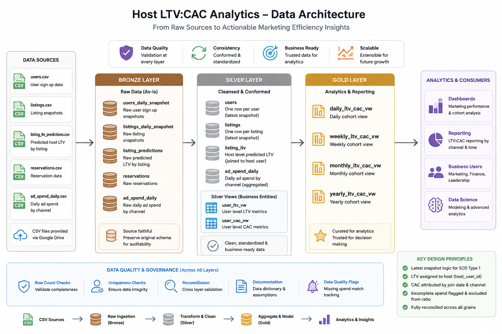

# Neighbor Host LTV:CAC Analytics

PostgreSQL implementation of a medallion-style data model that calculates predicted host lifetime value relative to customer acquisition cost at daily, weekly, monthly, and yearly join-date cohort grains.

## Modeling approach

The solution is organized into three layers:

- **Bronze:** Source-faithful tables matching the supplied CSV structure. No business transformations are applied so the raw data remains auditable.
- **Silver:** Latest user and listing snapshots are selected, channels are standardized, listing-level predictions are assigned to host users, and daily advertising spend is conformed by date and channel.
- **Gold:** Reporting views aggregate user-level LTV and CAC by join-date cohort and acquisition channel at daily, weekly, monthly, and yearly grains.

The Silver layer contains reusable user-level views rather than embedding business logic directly into Gold. This keeps reporting queries simple and makes the attribution logic independently testable.

## LTV and CAC attribution

Predicted `host_ltv` is first associated with the listing and then attributed to the listing's `host_user_id`. A user's cohort is always based on the user's `join_date`, not the listing date or prediction date. Users with no listings remain in the model with predicted LTV equal to zero.

Paid CAC is attributed by matching the user's `join_date` and normalized acquisition channel to daily advertising spend. Daily channel spend is divided by attributed signups to calculate acquisition cost per matched user. Organic, referral, and unattributed users receive zero paid CAC.

## Edge cases and data quality

- Latest snapshots are retained using one record per user and listing.
- Blank or null acquisition channels are classified as `unattributed`.
- Five listing predictions reference host users not present in the latest user snapshot; these records are retained in listing-level validation but cannot be assigned to a valid user cohort.
- Paid users without a matching spend record are flagged with `is_missing_spend_match`.
- LTV:CAC is returned as `NULL` for cohorts with incomplete paid-spend coverage to avoid overstating performance.
- Additive measures retain full precision; rounding is applied only to presentation metrics.
- All four Gold grains reconcile to 14,995 users, 146,364,176.01 predicted LTV, and 22,917,606.881642 acquisition cost.

## Tools used

- **PostgreSQL:** Relational modeling, transformations, window functions, views, and validation.
- **pgAdmin 4:** Database administration, SQL execution, and CSV imports.
- **ChatGPT:** Used as a review assistant to challenge modeling choices, improve validation coverage, and refine documentation. All SQL logic and outputs were tested in PostgreSQL before inclusion.

Representative AI prompts:

1. “Review this LTV:CAC attribution design and identify edge cases involving users without listings, unpaid channels, and missing spend.”
2. “Suggest reconciliation queries proving that daily, weekly, monthly, and yearly cohort views preserve identical totals.”
3. “Review whether incomplete paid-spend coverage should produce a ratio or a data-quality flag.”

## Execution

See [`SETUP.md`](SETUP.md) for reproducible pgAdmin instructions. Run the scripts in this order:

`bronze/bronze.sql` → import supplied CSVs → `silver/silver.sql` → `gold/gold.sql` → validation scripts.
